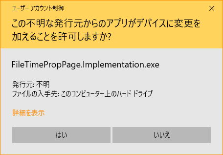

# FileTimePropPage

+ A windows shell extension that is used to change file's create/update/access time through property page (in Japanese).
+ Development environment: `.NET Framework 4.8` `Windows 10 20H2` `VS2019`.

### Dependencies

+ `SharpShell 2.7.2`

### Compile

+ If you are using command line tool such as `dotnet cli`:

```bash
# FileTimePropPage.Extension project
cd FileTimePropPage.Extension
rm bin/ obj/ -rf
dotnet msbuild -property:Configuration=Release -property:Platform=x64
# -> FileTimePropPage.Extension\bin\x64\Release\FileTimePropPage.Extension.dll

# FileTimePropPage.Implementation project
cd FileTimePropPage.Implementation
rm bin/ obj/ -rf
dotnet msbuild -property:Configuration=Release -property:Platform=x64
# -> FileTimePropPage.Implementation\bin\x64\Release\FileTimePropPage.Implementation.exe
```

+ If you are using Visual Studio:

```bash
# You just need to open the sln file, build it in x64 platform with Release configuration.
```

### Register

+ Note that you need to add the following into PATH.
    + `sn.exe` `ildasm.exe` (Program Files\Microsoft SDKs\Windows\vx.xA\bin\NETFX x.x Tools)
    + `ilasm.exe` `regasm.exe` (Windows\Microsoft.NET\Framework64\vx.x.x)
+ Open cmd as administrator, and you may need to restart explorer.exe.

```bash
Register.bat
# or execute the following commands

cd FileTimePropPage.Extension\bin\x64\Release
sn -k key.snk # generate key
ildasm FileTimePropPage.Extension.dll /OUTPUT=FileTimePropPage.Extension.il
ilasm FileTimePropPage.Extension.il /DLL /OUTPUT=FileTimePropPage.Extension.dll /KEY=key.snk # add key to dll
regasm /codebase FileTimePropPage.Extension.dll # register

# Note that before replace the dll, you need to unregister it first !!!
```

+ Finally, setup registry for FileTimePropPage.Implementation.

```reg
; Use RegisterImpl.reg

; Note to replace to your FileTimePropPage.Implementation.exe path.
[HKEY_CURRENT_USER\SOFTWARE\AoiHosizora\FileTimePropPage]
"Implementation"="\"E:\\Projects\\FileTimePropPage\\FileTimePropPage.Implementation\\bin\\x64\\Release\\FileTimePropPage.Implementation.exe\""
```

### Unregister

+ Open cmd as administrator.

```bash
Unregister.bat
# or execute the following commands

cd FileTimePropPage.Extension\bin\x64\Release
regasm /u FileTimePropPage.Extension.dll # unregister
```

### Screenshots

|||
|---|---|

### References

+ [dwmkerr/sharpshell](https://github.com/dwmkerr/sharpshell)
+ [Property Sheet Extensions](https://github.com/dwmkerr/sharpshell/blob/master/docs/extensions/propertysheetextension/propertysheetextension.md)
